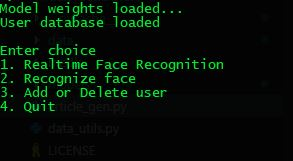
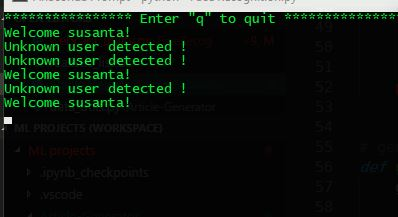
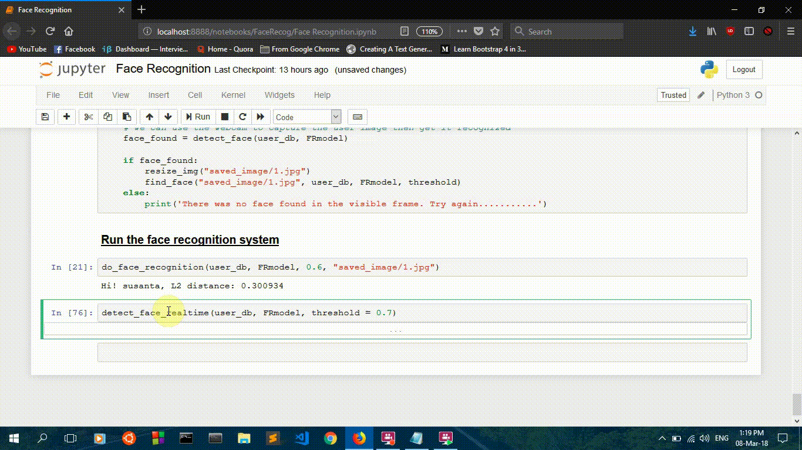

# <u>Face Recognition System
Face Recognition system using **Siamese Neural network**. The model is based on the **FaceNet model**. 
**OpenCV** implementaion has been done for realtime face detection and recognition using the network. The model uses face encodings for identifying users.  
 
### There are two versions available:
1. **Jupyter Notebook**: Explains things in greater details.  
2. **Command line program**: Python script for the same. Below are some snapshots of it.  

 
 

### Face recognition
 There are two options:
 1. **Realtime facial recognition:** In this the model does facial recognition in realtime using the camera feed with text overlay telling whether the user is registered with the system or not.
 2. **Normal facial recognition:** In this the camera starts for 5-6 seconds and snaps some pictures of the user, then the picture is used for recognition. 
 
 
 ### Options for adding a new user:
 The program uses a python dictionary for mapping for users to their corresponding face encodings. 
 1. **Using the image path**: In this the **full image name** is provided along with the **name** of the person.
 The image should be saved in the **images** folder.
 2. **Using the camera**: The webcam starts and takes picture of the user in the frame and registers his/her. 
 
 
 ### Controlling the recognition accuracy:
 The threshold value controls the confidence with which the face is recognized, you can control it by changing the threshold parameter value in function calls.   
 
 ## Here is a demo gif
 #### NOTE: The FPS is very less in the gif that is why it seems to lag everywhere.
   
 
 
#### References:
- Code for Facenet model is based on the assignment from Convolutional Neural Networks Specialization by Deeplearning.ai on Coursera. 
https://www.coursera.org/learn/convolutional-neural-networks/home/welcome 
- Florian Schroff, Dmitry Kalenichenko, James Philbin (2015). [FaceNet: A Unified Embedding for Face Recognition and Clustering](https://arxiv.org/pdf/1503.03832.pdf)
- Yaniv Taigman, Ming Yang, Marc'Aurelio Ranzato, Lior Wolf (2014). [DeepFace: Closing the gap to human-level performance in face verification](https://research.fb.com/wp-content/uploads/2016/11/deepface-closing-the-gap-to-human-level-performance-in-face-verification.pdf) 
- The pretrained model used is inspired by Victor Sy Wang's implementation and was loaded using his code: https://github.com/iwantooxxoox/Keras-OpenFace.
- A lot of inspiration from the official FaceNet github repository: https://github.com/davidsandberg/facenet 
