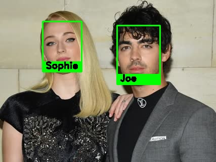

# Overview
This face recognition library is built with ease and customization in mind. There are numerous control parameters to control how you want to use the features, be it face detection, face recognition on videos or with webcam. 
 
At its core the facial recognition system uses **Siamese Neural network**. Over the years there have been different architectures published and implemented. The library uses **dlib**'s face recognition model, which is inspired from **ResNet-34** network. The modified ResNet-34 has 29 conv layers. The model achieved 99.38% accuracy on LFW dataset.

There are 4 different face detectors for usage. Wrappers for video and webcam processing are provided for convenience.  

# Sample Output

## Processed Video
 

## Processed Images

# Architecture
 
These are the main components:
1. Face Detection: There are 4 different face detectors with different cropping options.
2. Face Recognition: Responsible for handling facial recognition related functionalities like registering facial data etc. 
3. Storage: The systems provides abstract definitions of cache and persistent storage. For usage a simple cache using python's native data structure is provided along side a persistent storage with JSON. If needed the abstract classes can be extended to integrate better storage systems. 
4. Utilities: Methods for handling image, video operations, validations etc.

# Setup
There are multiple ways to set this up.

# Usage

# References